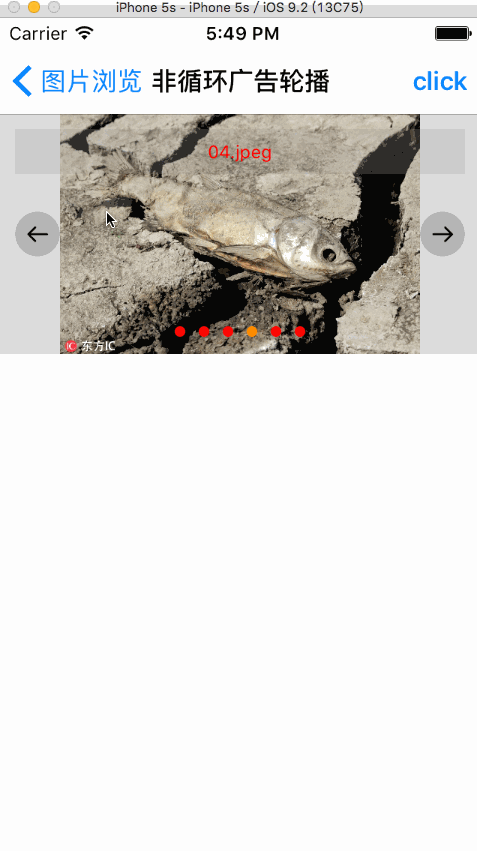

# SYImageBrowser
图片轮播广告，或图片浏览视图控件
使用SDWebImage加载网络图片，使用时注意添加该框架。

# 效果图

# 功能说明
 * 网络图片，或本地图以广告轮播形式显示，也可以浏览形式显示（或视图控制器浏览显示形式）
  * 自动轮播显示
  * 左右滑动显示
  * 双击放大，或缩小显示
  * 双指拿捏放大，或缩小显示
  * 浏览形式时，可以进行删除操作

# 广告图片轮播

~~~ javascript

// 导入头文件
#import "SYImageBrowse.h"

~~~ 

~~~ javascript
// 网络图片
//NSMutableArray *images = [[NSMutableArray alloc] initWithCapacity:7];
//[images addObject:@"http://img0.bdstatic.com/img/image/6946388bef89760a5a2316f888602a721440491660.jpg"];
//[images addObject:@"http://img0.bdstatic.com/img/image/6446027056db8afa73b23eaf953dadde1410240902.jpg"];
//[images addObject:@"http://img0.bdstatic.com/img/image/379ee5880ae642e12c24b731501d01d91409804208.jpg"];
//[images addObject:@"http://img0.bdstatic.com/img/image/c9e2596284f50ce95cbed0d756fdd22b1409207983.jpg"];
//[images addObject:@"http://img0.bdstatic.com/img/image/5bb565bd8c11b67a46bcfb36cc506f6c1409130294.jpg"];
//[images addObject:@"http://d.hiphotos.baidu.com/image/w%3D230/sign=3941c09f0ef431adbcd2443a7b37ac0f/bd315c6034a85edf0647db2e4b540923dc5475f7.jpg"];
// 本地图片
NSArray *images = @[@"01.png", @"02.png", @"03.png", @"04.png", @"05.png", @"06.png"];
// 标题
NSArray *titles = @[@"01.png", @"02.png", @"03.png", @"04.png", @"05.png", @"06.png"];

~~~ 

~~~ javascript

CGRect rect = self.view.bounds;
rect = CGRectMake(0.0, 0.0, self.view.frame.size.width, self.view.frame.size.height);
// 实例化
SYImageBrowse *imageBrowse = [[SYImageBrowse alloc] initWithFrame:rect view:self.view];
imageBrowse.autoresizingMask = UIViewAutoresizingFlexibleHeight;
imageBrowse.backgroundColor = [UIColor colorWithWhite:0.0 alpha:0.3];
// 类型
imageBrowse.browseMode = SYImageBrowseAdvertisement;
// 页码
imageBrowse.pageMode = SYImageBrowsePageControl;
imageBrowse.pageAlignmentMode = SYImageBrowsePageControlAlignmentCenter;
imageBrowse.pageNormalColor = [UIColor redColor];
imageBrowse.pageSelectedColor = [UIColor greenColor];
imageBrowse.showPageControl = YES;
imageBrowse.pageIndex = 3;
// 标题
imageBrowse.showText = YES;
imageBrowse.textMode = SYImageBrowseTextAlignmentCenter;
imageBrowse.textBgroundColor = [UIColor redColor];
imageBrowse.textColor = [UIColor yellowColor];
// 自动播放
imageBrowse.isAutoPlay = NO;
// 图片样式
imageBrowse.imageContentMode = SYImageBrowseContentFit;
// 数据源
imageBrowse.imageSource = images;
imageBrowse.titleSource = titles;
// 交互
imageBrowse.imageSelected = ^(NSInteger index){
    NSLog(@"imageSelected %ld", index);
};
imageBrowse.showDeleteButton = YES;
imageBrowse.imageDelete = ^(NSInteger index){
    NSLog(@"imageDelete %ld", index);
};

~~~

# 图片浏览视图控制器模式

~~~ javascript

// 初始化图片浏览器
SYImageBrowseViewController *browseVC = [[SYImageBrowseViewController alloc] init];
// 图片显示模式
browseVC.imageContentMode = SYImageBrowseContentFit;
// 删除按钮类型
browseVC.deleteType = SYImageBrowserDeleteTypeImage;
browseVC.deleteTitle = @"Delete";
browseVC.deleteTitleFont = [UIFont boldSystemFontOfSize:13.0];
browseVC.deleteTitleColor = [UIColor blackColor];
browseVC.deleteTitleColorHighlight = [UIColor redColor];
// 图片浏览器图片数组
browseVC.imageArray = images;
// 图片浏览器当前显示第几张图片
browseVC.imageIndex = 2;
// 图片浏览器浏览回调（删除图片后图片数组）
browseVC.ImageDelete = ^(NSArray *array){
    NSLog(@"array %@", array);

    // 如果有引用其他属性，注意弱引用（避免循环引用，导致内存未释放）
};
// 图片点击回调
browseVC.ImageClick = ^(NSInteger index){
    NSLog(@"点击了第 %@ 张图片", @(index));
};
// 图片浏览器跳转
[self.navigationController pushViewController:browseVC animated:YES];

~~~ 

